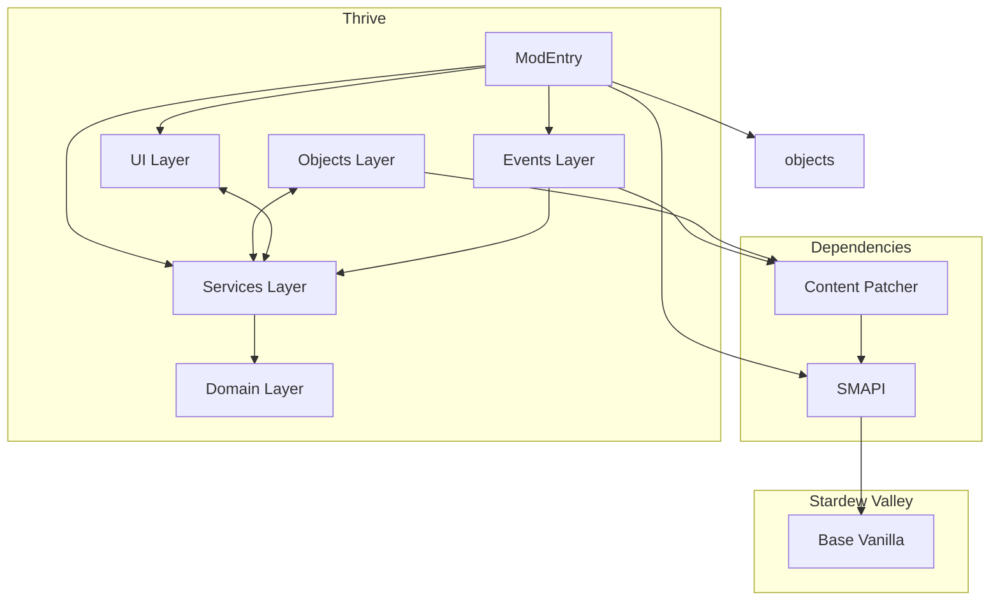

# Thrive: A Stardew Valley Mod – Design Document

**Author:** SomebodyUnown 
**Last Updated:** 2025-08-20
**Project Status:** In Progress, v0.2.0

---

## 1. Overview

### Project Overview
This project is a **Stardew Valley** mod that deepens the complexity of the base farming mechanics. It shifts player focus from raw crop profitability toward **soil health, crop diversity, and sustainable farming strategies**.  

Rather than only optimizing for profit-per-day, players will weigh the **long-term consequences of their farming choices**, creating a more dynamic and strategic agricultural experience.

### Motivation
Whether in vanilla Stardew Valley or in heavily-modded playthroughs with dozens of new crops, players often converge on the same handful of high-profit crops each season. This results in repetitive gameplay and underutilized plant types.  

This mod changes that by rewarding:
- **Crop diversity** — mixing crops for better soil health.  
- **Long-term soil management** — avoiding over-exploitation of the same land.  
- **Sustainable planning** — trading short-term gains for seasonal or multi-year advantages.

The goal is to make flowers, niche crops, and underused plants (including fungi) **strategically valuable**.

### Design Philosophy
While not a 1:1 simulation of real-world agriculture, the mechanics draw inspiration from actual farming principles. In real life, repeatedly planting the same crop on the same soil leads to nutrient depletion and reduced yields — this mod embraces that idea, but keeps it approachable and fun.

The philosophy is to **blend realism with game balance**:
- Simple enough for casual players to understand.  
- Deep enough for challenge-seekers to master.  
- Flexible enough to work alongside popular content mods.

### Scope
- **Included:** Soil nutrient system, crop diversity bonuses, environmental impact mechanics, custom in-game tools, events via Content Patcher.  
- **Planned:** Player and NPC nutrition system, deeper and more comprehensive sustainable farming mechanics 
- **Excluded:** Overhauls to unrelated systems like fishing, mining, foraging, or combat.

---

## 2. Key Features

- **Soil Health System** – Track and manage soil nutrition levels that change over time based on crops planted and fertilizers used.
- **Dynamic Crop Effects** – Different crops replenish or deplete soil nutrients in differing quantities, affecting future yields.
- **Nutrition Mechanics** – Extend gameplay depth by introducing nutrition values for harvested crops, with planned future integration into character well-being.
- **Sustainability Incentives** – Balance short-term profits with long-term farm health to avoid soil degradation and reduced productivity.
- **Tool Integration** – Custom in-game tools (e.g., Soil/Crop Analyzer) for checking soil and crop data.
- **Event Integration** – In-game events that introduce mod mechanics, encourage sustainable farming practices, and provide the player with the in-game tools.
- **Dynamic Difficulty** - Allows configuration of number of nutrients to manage. 
- **Mod Compatibility** – Designed for integration with popular Content Patcher and C# mods that change or add to farming mechanics.
- **Efficient Performance** - Designed in a way that maximizes complexity of gameplay while being light on the computer.

---

## 3. Architecture

**Feature Roadmap to Architecture Mapping**

| Roadmap Version & Feature                                          | Domain Layer | Services Layer | objects Layer | UI Layer   | Events Layer | ModEntry    |
|--------------------------------------------------------------------|--------------|----------------|-------------|------------|--------------|-------------|
| **v0.1 – Basic Core Systems**                                      | ✅           | ✅             |             |            |              | ✅         |
| Crop & soil data structures                                        | ✅           |                |             |            |              |             |
| Initialization states                                              | ✅           |                |             |            |              |             |
| Save/load data via SMAPI                                           |              | ✅             |             |            |              | ✅          |
| Daily nutrient depletion & bonuses/penalties                       | ✅           |                |             |            |              |             |
| Dynamically adjust crop quality yields                            | ✅           |                |             |            |              |             |
| **v0.2 – Balancing**                                               | ✅           |                |             |            |              |             |
| Adjust formulas in various game mechanics                          | ✅           |                |             |            |              |             |
| **v0.3 – Game Integration**                                        | ✅           | ✅             | ✅          |           |              | ✅          |
| Hook into game events                                              |              | ✅             |             |            |              | ✅          |
| Custom tool/object to measure soil/crop health                       |              | ✅             | ✅          |            |              |             |
| Custom objects to improve soil quality                               |              | ✅             | ✅          |            |              | ✅          |
| Discourage farming on non-farm maps                                |              | ✅             |             |            |              | ✅          |
| **v0.4 – Compatibility & Edge Cases**                              | ✅           | ✅             |             |            |              |             |
| Context-tag-based support                                          | ✅           | ✅             |             |            |              |             |
| Edge-case object support                                             | ✅           | ✅             |             |            |              |             |
| **v0.5 – Player Interactions & UI**                                |              | ✅             | ✅          | ✅         |              |             |
| HUD for soil health                                                |              | ✅             | ✅          | ✅         |              |             |
| HUD for crop depletion/replenishment                               |              | ✅             | ✅          | ✅         |              |             |
| Menu for known data                                                |              | ✅             |             | ✅         |              |             |
| Menu for current map data                                          |              | ✅             |             | ✅         |              |             |
| Integration with Better Game Menu                                  |              |                |              | ✅         |              | ✅         |
| **v0.6 – Configurability & Code Quality**                          | ✅           | ✅             |             |             |              |            |
| Additional and adjustable number of soil variables                 | ✅           | ✅             |             |             |              |            |
| Config file, GMCM support                                          |              | ✅             |              | ✅         |              | ✅         |
| i18n support                                                       |              |                |              | ✅         |              | ✅         |
| Tractor mod compatibility                                          |              | ✅             |              |            |              | ✅         |
| **v0.8 – Lore Integration**                                        |              |                |              | ✅         | ✅           | ✅         |
| Demetrius mail & events                                            |              |                |              |            | ✅           | ✅         |
| Farming-related character events                                   |              |                |              |            | ✅           | ✅         |
| ConversationTopics                                                 |              | ✅             |              |            | ✅           |            |

✅ = Primary layer where the feature is implemented

---

## Future Architectural Considerations

### 1. Domain-Driven, Service-Based Structure
The architecture follows a **domain-driven** approach, separating core logic (Domain layer) from orchestration (Services) and UI or Event concerns.  
Project Structure:
  src/
    Domain/
    Services/
    Objects/
    Tools/
    UI/
    Events/
    ModEntry.cs
  assets/
  docs/
  tests/

### 2. Utility/Helper Functions
If utility or helper methods grow in number:
- Group them into a dedicated `Utils/` folder or `Helpers.cs` file.
- Avoid bloating domain classes with unrelated helper logic.

### 3. Event-Driven Communication
For a highly decoupled project:
- Keep a lightweight event system for communication between modules.
- Keep ModEntry as the registration point, not the main logic holder.

### 4. Scalability for Future Features
If major new features are planned:
- Create new submodules instead of overloading existing ones (e.g., a separate `Pests/` module if adding pest mechanics).
- Ensure SaveData is versioned to allow safe upgrades without corrupting player saves.

### 5. Testing Strategy
While SMAPI mods are harder to unit-test:
- Keep core logic testable by isolating it from SMAPI calls.
- Where possible, abstract game dependencies behind interfaces and mock them in tests.
- Make use of SMAPI console methods such as 'export'
- Use SMAPI's logging system to keep track of changes over time or state in game.

### 6. Documentation
- Maintain well documented and readable code to keep it easy to understand.
- Maintain `Design.md` documentation for developers who are interested in contributing technical expertise.

---

## Dependency Diagram

---

## 4. Game/Tech Integration

- **Game:** Stardew Valley (PC/Linux/Mac, target 1.6+)
- **Frameworks:**
  - **SMAPI** – Primary modding API for loading custom C# logic into the game loop and data model.
  - **Content Patcher** – Handles adding content and asset (e.g., custom events) without custom code.
- **Language:** C# (target .NET Framework 6.0)
- **Tooling:** Visual Studio 2022 for development and debugging.
- **Build System:** MSBuild with SMAPI mod packaging format.

---

## 5. Planned Roadmap
### v0.1 – Foundations
- [x] Design and create multiple data structures to hold crop and soil data.
- [x] Define initialization states for defined data structures.
- [x] Define daily nutrient depletion depending on existing properties of in-game objects
- [x] Add compatibility with crops utilizing context tags that mention 'magic'
- [x] Save or create crop and soil data through SMAPI
- [x] Add SMAPI console logging to check for bugs and game state changes

### v0.2 - More Growth Mechanics
- [ ] Logic to adjust crop quality yields based on its overall health during growth.
- [ ] Define logic for the creation of customized objects that undo soil depletion.
- [ ] Custom player tool to measure soil and crop health.
- [ ] i18n support.
- [ ] Completely hook finished mechanics into game start, save start, day start, harvest, planting, and tool use, etc.

### v0.3 – Balancing
- [x] Write test method that finds, creates and saves data for all in-game crops
- [x] Write script to analyze the modded crop data and their results
- [ ] Adjust formulas for initializing base crop properties and their soil depletion rates
- [ ] Implement multiple formulas that would be chosen at the start of a game save
- [ ] Update code allowing for adjustment of soil variables.
- [ ] Configuration file to adjust mechanics

### v0.4 - Basic Compatibility and Edge Cases
- [ ] Introduce additional mechanics based on context tags of a crop or seed.
- [ ] Giant crop compatibility
- [ ] Check for and add logic to include "crop-like", growable objects that are coded differently.
- [ ] Discourage farming in non-farm maps both to improve mod performance and for lore purposes.
- [ ] Add save-versioning for Thrive's moddata
- [ ] Tractor mod compatibility
- [ ] Walk of Life and Vanilla Plus Professions compatibility

### v0.5 - Player Interactions and User Interfaces
- [ ] HUD elements for viewing soil health for custom tool/object
- [ ] HUD elements for viewing crop depletion or replenishment rates for custom tool or 
- [ ] Menu to look at all known data
- [ ] Menu to look at rough known data of current map.
- [ ] Integration with mod 'Better Game Menu'

### v0.6 - Beta Test 1
- [ ] Recruit testers from modding community to gather performance metrics and bug reports.
- [ ] Collect professional feedback from experienced mod authors and players.
- [ ] Code review from experienced mod authors
- [ ] Fix bugs found and reported errors.
- [ ] Refactor based on code review
- [ ] Add additional compatibility for common conflicting mods.
- [ ] Change, add, or edit mechanics based on feedback gathered.

### v0.7 - Lore Integration
- [ ] Mail from Demetrius informing the user of basic mechanics
- [ ] Event with Demetrius to encourage consideration of mechanics and to give player ability to analyze crop/soil stats.
- [ ] Event with various other NPCs (???)
- [ ] ConversationTopics depending on how well player manages their farm and its crops/soil.

### v0.8 - Beta Test 2
- [ ] Collect narrative feedback and bug reports
- [ ] Fix reported issues and bugs
- [ ] Improve event writing for pacing, tone, and/or clarity

### v1.0 - Release
- [ ] Add GitHub release with changelog and installation instructions
- [ ] Write a mod description that compels players but also effectively informs and publish on nexusmods.
- [ ] Gather player feedback for potential post-launch patches

### v2.0 - Nutrition Mechanics for Characters

### v3.0 - Expanded Sustainable Farming
- [ ] Deeper mechanics involving pests or symbiotic animals or other organisms

### v3.2 - Lore Integration with Newly Relevant Characters

---

## 6. Design Decisions and Trade-offs

### Formula-based balancing instead of per-crop tuning

- Rather than manually assigning nutrient values to thousands of crops, the system derives values from existing crop properties using mathematical formulas.

- *Trade-off*: This sacrifices fine-grained control over individual crop balance but ensures scalability and consistency.

### Randomized but consistent formulas per save

- At the start of a save, multiple candidate formulas are available. A small subset is randomly chosen and applied consistently throughout that save.

- *Trade-off*: This prevents players from becoming too accustomed to a fixed soil mechanic system, increasing replay variety. However, it introduces unpredictability or difficulty for players who want deterministic behavior.

### Mana stored at map level, not soil level

- Mana is implemented as a map-wide property rather than a per-tile soil property.

- *Trade-off*: This sacrifices granularity in how mana might interact with individual soil tiles, but reduces data overhead (since soil data exists for every hoe-able tile).

### Lazy initialization of soil and crop data

- Data is only created when necessary (e.g., when a tile is first hoed, a crop is first planted/harvested, or a new crop type is introduced).

- *Trade-off*: This minimizes memory and save file size, but introduces additional logic paths for “first use” events and potential edge cases.

### Excluding artisan machine balance from scope

- Interactions with artisan machines (e.g., kegs, preserves jars) are intentionally excluded from the current balancing system.

- *Trade-off*: This may result in temporary imbalance relative to machine-based profits until a future phase but narrows the scope to soil and crop mechanics.

### Python for data analysis instead of C#

- Data is exported from SMAPI and analyzed using python libraries numpy and matplotlib

- *Trade-off*: Python provides rapid prototyping, easier statistical analysis, and better tooling for balancing compared to C#. However, this requires additional functionality for accumulating data and exporting it outside the game.

---

## 7. Glossary

| Term                     | Definition                                                                                                       |
| ------------------------ | ---------------------------------------------------------------------------------------------------------------- |
| **SMAPI**                | *Stardew Modding API*, the main modding framework for Stardew Valley, providing hooks into game events and code. |
| **Mod**                  | Short for *modification*. A package of custom code, assets, or data that alters or extends the base game’s behavior without modifying the original game files directly. In Stardew Valley, mods are typically loaded by SMAPI.                   |
| **Content Patcher (CP)** | A modding framework that lets other mods change or add assets and data to the game via JSON instead of C#.          |
| **Event Trigger**        | A state or moment in game (e.g., `DayStarted`, `CropHarvested`) that SMAPI exposes for mod logic to run.                 |
| **Save Data**            | Game or mod state stored between sessions, usually as JSON in Stardew modding.                            |
| **Context Tags**         | Metadata tags attached to game content entries (e.g., crops, objects). Through Content Patcher and SMAPI, mods can use these tags to apply conditional changes or logic.   |
| **i18n**                 | A format mods use to provide ease of translations.                                                               | 
|**moddata**               | Custom data made and used by a mod. Can be saved or loaded through SMAPI |

---

## 8. References
- Beginner's Guide: https://stardewvalleywiki.com/Modding:Modder_Guide/Get_Started
- Saving and retrieving data: https://stardewvalleywiki.com/Modding:Modder_Guide/APIs/Data
- API Reference: https://stardewvalleywiki.com/Modding:Modder_Guide/APIs
- Stardew Valley decompiled code (via ILSpy)
- Stardew Valley Wiki: https://stardewvalleywiki.com/Stardew_Valley_Wiki
