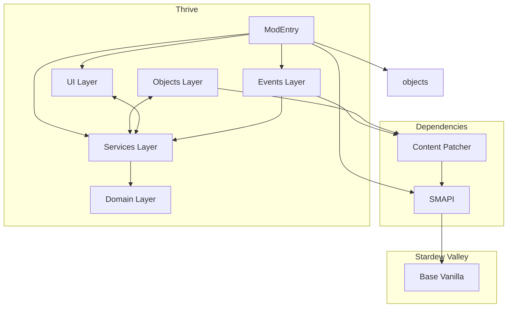

# Thrive: A Stardew Valley Mod – Design Document

**Author:** SomebodyUnown 
**Last Updated:** 2025-09-11
**Project Status:** In Progress, v0.2.0alpha

---
# Table of Contents
          
1. [Overview](#1-overview)  
   - [Project Overview](#project-overview)
   - [Motivation](#motivation)
   - [Design Philosophy](#design-philosophy)
   - [Scope](#scope)
2. [Key Features](#2-key-features)  
3. [Architecture](#3-architecture) 
    - [Future Architectural Considerations](#future-architectural-considerations)
    - [Dependency Diagram](#dependency-diagram)
4. [Game/Tech Integration](#4-gametech-integration) 
5. [Planned Roadmap](#planned-roadmap)  
    - [v0.1 – Getting Started and Foundations](#v01--getting-started-and-foundations)
    - [v0.2 - Clear Definitions and Advanced Mechanics](#v02---clear-definitions-and-advanced-mechanics)
    - [v0.3 – Balancing and Edge Cases](#v03--balancing-and-edge-cases)
    - [v0.4 - Player Interactions and User Interfaces](#v04---player-interactions-and-user-interfaces)
    - [v0.5 Multiplayer Support and Compatibility](#v05-multiplayer-support-and-compatibility)
    - [v0.6 - Beta Test 1](#v06---beta-test-1)
    - [v0.7 - Lore Integration](#v07---lore-integration)
    - [v0.8 - Beta Test 2](#v08---beta-test-2)
    - [v1.0 - Release](#v10---release)
6. [Design Decisions and Trade-offs](#6-design-decisions-and-trade-offs)  
7. [Glossary](#7-glossary)  
8. [References](#8-references)  

---

## 1. Overview

### Project Overview
This project is a **Stardew Valley** mod that deepens the complexity of the base farming mechanics. It shifts player focus from raw crop profitability toward **soil health, crop diversity, and sustainable farming strategies**.  

Rather than only optimizing for profit-per-day, players will weigh the **long-term consequences of their farming choices**, creating a more dynamic and strategic agricultural experience.

### Motivation
Whether in vanilla Stardew Valley or in heavily-modded playthroughs with dozens of new crops, players often converge on the same handful of high-profit crops each season. This results in repetitive gameplay and underutilized plant types.  

This mod changes that by rewarding:
- **Crop diversity** — mixing crops for better soil health.  
- **Long-term soil management** — avoiding over-exploitation of the same land.  
- **Sustainable planning** — trading short-term gains for seasonal or multi-year advantages.

The goal is to make flowers, niche crops, and underused plants (including fungi) **strategically valuable**.

### Design Philosophy
While not a 1:1 simulation of real-world agriculture, the mechanics draw inspiration from actual farming principles. In real life, repeatedly planting the same crop on the same soil leads to nutrient depletion and reduced yields — this mod embraces that idea, but keeps it approachable and fun.

The philosophy is to **blend realism with game balance**:
- Simple enough for casual players to understand.  
- Deep enough for challenge-seekers to master.  
- Flexible enough to work alongside popular content mods.

### Scope
- **Included:** Soil nutrient system, crop diversity bonuses, environmental impact mechanics, custom in-game tools, events via Content Patcher.  
- **Planned:** Player and NPC nutrition system, deeper and more comprehensive sustainable farming mechanics 
- **Excluded:** Overhauls to unrelated systems like fishing, mining, foraging, or combat.

---

## 2. Key Features

- **Soil Health System** – Track and manage additional soil properties that change over time based on crops planted and fertilizers used.
- **Dynamic Crop Effects** – Different crops replenish or deplete soil nutrients in differing quantities, affecting future yields.
- **Additional Soil Properties** – Extend gameplay depth by introducing additional values for soil and harvested crops, with planned future integration into character well-being.
- **Sustainability Incentives** – Balance short-term profits with long-term farm health to avoid soil degradation and reduced productivity.
- **Tool Integration** – Custom in-game tools (e.g., Soil/Crop Analyzer) for checking soil and crop data.
- **Event Integration** – In-game events that introduce mod mechanics, encourage sustainable farming practices, and provide the player with the in-game tools.
- **Dynamic Difficulty** - Allows configuration of number of nutrients to manage. 
- **Mod Compatibility** – Designed for integration with popular Content Patcher and C# mods that change or add to farming mechanics.
- **Efficient Performance** - Designed in a way that maximizes complexity of gameplay while being light on the computer.

---

## 3. Architecture

**Feature Roadmap to Architecture Mapping**

| Roadmap Version & Feature                           | Domain Layer | Services Layer | Objects Layer | UI Layer   | Events Layer | ModEntry    |
|-----------------------------------------------------|--------------|----------------|---------------|------------|--------------|-------------|
| **v0.1 – Getting Started and Foundations**          | ✅           | ✅             |              |            |               |            |
| Crop & soil data structures                         | ✅           |                |               |            |              |             |
| Initialization states                               | ✅           |                |               |            |              |             |
| Crop property depletion rates                       | ✅           |                |               |            |              |             |
| Update growing crop properties.                     | ✅           |                |               |            |              |             |
| Crop/soil data save/load                            |              | ✅             |               |            |              | ✅         |
| SMAPI console logging                               |              | ✅             |               |            |              | ✅         |
| **v0.2 - Clear Definitions and Advanced Mechanics** | ✅           | ✅             | ✅           |            |              | ✅          |
| Config file, GMCM support                           |              | ✅             |               |            |              | ✅         |
| i18n support                                        |              |                |               |            |              | ✅          |
| Adjustable number of soil properties.               | ✅           | ✅             |               |            |              |            |
| Randomized distributions per save                   | ✅           | ✅             |               |            |             |             |
| Adjust yields and quality  on harvest.              | ✅           |                |               |            |              |             |
| Harmony patch Crops.harvest                         |              | ✅             |                |           |              | ✅         |
| Integrate onto game triggers                        |              | ✅             |               |            |              | ✅         |
| Custom tool/object to measure soil/crop health      |              | ✅             | ✅           |            |              | ✅          |
| Custom objects to improve soil quality              |              | ✅             | ✅           |            |              | ✅          |
| **v0.3 – Balancing and Edge Cases**                 | ✅           | ✅             |              |            |              | ✅          |
| Test methods                                        |              |                |               |            |              |             |
| Script to analyze modded crop data                  |              |                |               |            |              |             |
| Balance formulas in various game mechanics          | ✅           |                |               |            |              |             |
| Giant crop compatibility.                           |              | ✅              |              |            |              |             |
| Context-tag-based support                           | ✅           | ✅             |              |            |              |             |
| Edge-case object support                            | ✅           | ✅             |              |            |              |             |
| Discourage farming on non-farm maps                 |              | ✅             |               |            |              | ✅         |
| Save-versioning                                     |              | ✅             |               |            |              | ✅         |
| **v0.4 – Player Interactions & UI**                 |              | ✅             | ✅           | ✅         |              | ✅          |
| HUD for soil health                                 |              | ✅             | ✅           | ✅         |              |             |
| HUD for crop depletion/replenishment                |              | ✅             | ✅           | ✅         |              |             |
| Menu for known data                                 |              | ✅             |              | ✅         |              |             |
| Menu for current map data                           |              | ✅             |              | ✅         |              |             |
| Integration with Better Game Menu                   |              |                |               | ✅         |              | ✅         |
| **v0.7 – Lore Integration**                         |              |                |               |            | ✅           | ✅         |
| Demetrius mail                                      |              |                |               |            | ✅           | ✅         |
| Demetrius events                                    |              |                |               |            | ✅           | ✅         |
| Farming-related character events                    |              |                |               |            | ✅           | ✅         |
| ConversationTopics                                  |              |                |               |            | ✅           | ✅         |

✅ = Layer where the features are implemented

---

## Architectural Considerations

### 1. Domain-Driven, Service-Based Structure
The architecture follows a **domain-driven** approach, separating core logic (Domain layer) from orchestration (Services) and UI or Event concerns.  
Project Structure:
  src/
    Domain/
    Services/
    UI/
    Objects/
    Tools/
    Events/
    ModEntry.cs
    ModConfigs.cs
  assets/
  docs/
  tests/

### 2. Utility/Helper Functions
If utility or helper methods grow in number:
- Group them into a dedicated `Utils/` folder or `Helpers.cs` file.
- Avoid bloating domain classes with unrelated helper logic.

### 3. Event-Driven Communication
For a highly decoupled project:
- Keep a lightweight event system for communication between modules.
- Keep ModEntry as the registration point, not the main logic holder.

### 4. Scalability for Future Features
If major new features are planned:
- Create new submodules instead of overloading existing ones (e.g., a separate `Pests/` module if adding pest mechanics).
- Ensure SaveData is versioned to allow safe upgrades without corrupting player saves.

### 5. Testing Strategy
While SMAPI mods are harder to unit-test:
- Keep core logic testable by isolating it from SMAPI calls.
- Where possible, abstract game dependencies behind interfaces and mock them in tests.
- Make use of SMAPI console methods such as 'export'
- Use SMAPI's logging system to keep track of changes over time or state in game.

### 6. Documentation
- Maintain well documented and readable code to keep it easy to understand.
- Maintain `Design.md` documentation for developers who are interested in contributing technical expertise.

---

## Dependency Diagram

---

## 4. Game/Tech Integration

- **Game:** Stardew Valley (PC/Linux/Mac, target 1.6+)
- **Frameworks:**
  - **SMAPI** – Primary modding API for loading custom C# logic into the game loop and data model.
  - **Content Patcher** – Handles adding content and asset (e.g., custom events) without custom code.
- **Language:** C# (target .NET 6.0), CIL
- **Tooling:** Visual Studio 2022 for development and debugging.
- **Build System:** MSBuild with SMAPI mod packaging format.

---

## 5. Planned Roadmap
### v0.1 – Getting Started and Foundations
- [x] Initialize base project template and manifest.
- [x] Design and implement core data structures to hold crop and soil data.
- [x] Define initialization logic for data structures.
- [x] Define daily nutrient depletion based on in-game objects' existing properties.
- [x] Add compatibility with crops utilizing context tags mentioning 'magic'.
- [x] Logic to update health of a growing crop.
- [x] Enable saving and loading of crop/soil data via SMAPI.
- [x] Add SMAPI console logging for debugging and game state tracking.

### v0.2 - Clear Definitions and Advanced Mechanics
- [x] Add configuration file with Generic Mod Config Menu (GMCM) support for adjustable mechanics.
- [x] Implement infrastructure for persistent per-save but randomized distribution formulas for various mechanics.
- [x] Update code logic allowing for dynamic number of soil properties.
- [x] Define logic to adjust yields and quality based on crop health on harvest.
- [x] Harmony patch StardewValley.Crops.harvest to adjust quality.
- [ ] Update soil properties daily on all maps for all tiles with crops. 
- [ ] Define logic for customized objects that undo soil depletion.
- [ ] Introduce custom player tools for measuring soil and crop health.
- [ ] Add internationalization (i18n) support.
- [ ] Fully integrate mechanics onto game triggers (save start, day start, planting, harvest, tool use, etc.).

### v0.3 – Balancing and Edge Cases
- [x] Create test method to generate, save, and validate data for all in-game crops.
- [x] Implement script to analyze vanilla and modded crop data and results.
- [ ] Balance base crop initialization formulas and soil depletion rates.
- [ ] Introduce mechanics tied to existing crop/seed context tags.
- [ ] Add giant crop compatibility.
- [ ] Add support for non-standard “crop-like” growable and harvestable objects.
- [ ] Discourage farming outside farm maps for both lore and performance reasons.
- [ ] Add support for mid-save installation.
- [ ] Add save-versioning for Thrive's moddata

### v0.4 - Player Interactions and User Interfaces
- [ ] HUD elements for viewing soil health for custom tool/object
- [ ] HUD elements for viewing crop depletion or replenishment rates for custom tool or 
- [ ] Menu to view all known data.
- [ ] Menu to view summarized data for the current map.
- [ ] Integration with mod 'Better Game Menu'

### v0.5 Multiplayer Support and Compatibility
- [ ] Ensure soil data synchronization.
- [ ] Ensure crop attribute synchronization.
- [ ] Ensure consistency of formula selection.
- [ ] Ensure consistent harvest attribute outcomes.
- [ ] Add compatibility with mod “Tractor".
- [ ] Add compatibility with mods “Walk of Life” and “Vanilla Plus Professions”.

### v0.6 - Beta Test 1
- [ ] Recruit testers from the modding community to collect performance data and bug reports.
- [ ] Collect professional feedback from experienced mod authors and players.
- [ ] Conduct peer code review.
- [ ] Resolve reported bugs and errors.
- [ ] Refactor code based on review feedback.
- [ ] Add compatibility for frequently conflicting mods.
- [ ] Adjust mechanics based on beta test feedback.

### v0.7 - Lore Integration
- [ ] Add mail from Demetrius introducing basic mechanics.
- [ ] Add event with Demetrius to explain soil/crop stats, grant analysis tools, and encourage exploration.
- [ ] Create additional NPC events related to soil/crop management.
- [ ] Add ConversationTopics reflecting farm management success.

### v0.8 - Beta Test 2
- [ ] Collect narrative-specific feedback and bug reports.
- [ ] Resolve reported bugs and errors.
- [ ] Address reported issues and polish event writing (pacing, tone, clarity).

### v1.0 - Release
- [ ] Publish GitHub release with changelog and installation instructions.
- [ ] Publish mod with compelling description and informative instructions on NexusMods.
- [ ] Gather player feedback for potential post-launch patches

### v2.0 - Nutrition Mechanics for Characters

### v3.0 - Expanded Sustainable Farming and Environmental Impacts
- [ ] Add deeper mechanics involving pests or symbiotic animals or other organisms
- [ ] Add algae blooms tied to overcapping certain soil properties levels.

### v3.2 - Lore Integration with Newly Relevant Characters

---

## 6. Design Decisions and Trade-offs

### Formula-based balancing instead of per-crop tuning

- Rather than manually assigning nutrient values to thousands of crops, the system derives values from existing crop properties using mathematical formulas.

- *Trade-off*: This sacrifices fine-grained control over individual crop balance but ensures scalability and consistency.

### Randomized but consistent formulas per save

- At the start of a save, multiple candidate formulas are available. A small subset is randomly chosen and applied consistently throughout that save.

- *Trade-off*: This prevents players from becoming too accustomed to a fixed soil mechanic system, increasing replay variety. However, it introduces unpredictability or difficulty for players who want deterministic behavior.

### Mana stored at map level, not soil level

- Mana is implemented as a map-wide property rather than a per-tile soil property.

- *Trade-off*: This sacrifices granularity in how mana might interact with individual soil tiles, but reduces data overhead (since soil data exists for every hoe-able tile).

### Lazy initialization of soil and crop data

- Data is only created when necessary (e.g., when a tile is first hoed, a crop is first planted/harvested, or a new crop type is introduced).

- *Trade-off*: This minimizes memory and save file size, but introduces additional logic paths for “first use” events and potential edge cases.

### Excluding artisan machine balance from scope

- Interactions with artisan machines (e.g., kegs, preserves jars) are intentionally excluded from the current balancing system.

- *Trade-off*: This may result in temporary imbalance relative to machine-based profits until a future phase but narrows the scope to soil and crop mechanics.

### Python for data analysis instead of C#

- Data is exported from SMAPI and analyzed using python libraries numpy and matplotlib

- *Trade-off*: Python provides rapid prototyping, easier statistical analysis, and better tooling for balancing compared to C#. However, this requires additional functionality for accumulating data and exporting it outside the game.

### Harmony Patching

- Harmony is used to inject, change, or surpress game code during runtime. This allows for more control over game behaviors. eg. This enables us to alter the rewards from the harvesting action, etc.

- *Trade-off*: Harmony patching is a powerful but risky tool. Injecting code at runtime, especially in popular methods to alter such as Crops.Harvest results in a high chance of errors and compatibility issuees.

---

## 7. Glossary

| Term                     | Definition                                                                                                       |
| ------------------------ | ---------------------------------------------------------------------------------------------------------------- |
| **SMAPI**                | *Stardew Modding API*, the main modding framework for Stardew Valley, providing hooks into game events and code. |
| **Mod**                  | Short for *modification*. A package of custom code, assets, or data that alters or extends the base game’s behavior without modifying the original game files directly. In Stardew Valley, mods are typically loaded by SMAPI.                                           |
| **Content Patcher (CP)** | A modding framework that lets other mods change or add assets and data to the game via JSON instead of C#.       |
| **Event Trigger**        | A state or moment in game (e.g., `DayStarted`, `CropHarvested`) that SMAPI exposes for mod logic to run.         |
| **Save Data**            | Game or mod state stored between sessions, usually as JSON in Stardew modding.                                   |
| **Context Tags**         | Metadata tags attached to game content entries (e.g., crops, objects). Through Content Patcher and SMAPI, mods can use these tags to apply conditional changes or logic.   |
| **i18n**                 | A format mods use to provide ease of translations.                                                               | 
|**moddata**               | Custom data made and used by a mod. Can be saved or loaded through SMAPI                                         |
| **Harmony**              | A library for patching, replacing and decorating .NET methods during runtime.
| **transpiler**           | A program used to convert a programming language to another. In the case of this project, C# is converted into CIL before compilation.                                                                                                                                 |
| **transpiler patching**  | Inserting, removing, or modifying code after it has been run through the transpiler.                             |

---

## 8. References

1. Stardew Valley Modding API Reference – [Stardew Valley Wiki](https://stardewvalleywiki.com/Modding:Modder_Guide/APIs)  
2. Beginner’s Guide to Modding – [Stardew Valley Wiki](https://stardewvalleywiki.com/Modding:Modder_Guide/Get_Started)  
3. Saving and Retrieving Data – [Stardew Valley Wiki](https://stardewvalleywiki.com/Modding:Modder_Guide/APIs/Data)  
4. Harmony Patching & Transpilers Tutorial – [Stardew Modding Wiki](https://stardewmodding.wiki.gg/wiki/Tutorial:_Harmony_Patching#Transpilers)  
5. Harmony Library Documentation – [harmony.pardeike.net](https://harmony.pardeike.net/articles/intro.html)  
6. Stardew Valley Decompiled Code – Decompiled via ILSpy (for research purposes)  
7. Stardew Valley Wiki (General Reference) – [Stardew Valley Wiki](https://stardewvalleywiki.com/Stardew_Valley_Wiki)  
8. Generic Mod Config Menu (GMCM) – [GitHub Repository](https://github.com/spacechase0/StardewValleyMods/tree/develop/GenericModConfigMenu#for-c-mod-authors)  
