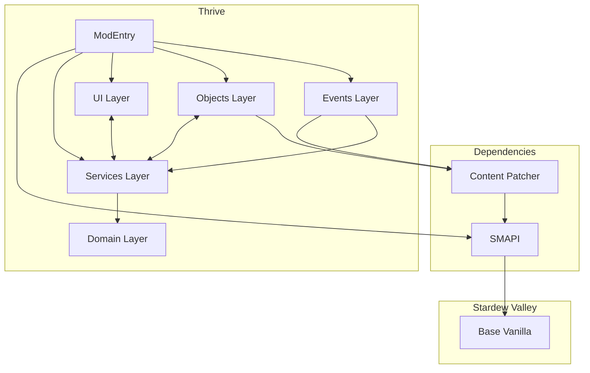

# Thrive: A Stardew Valley Mod – Design Document

**Author:** SomebodyUnown 
**Last Updated:** 2025-09-26
**Project Status:** In Progress, v0.3.0-alpha

Thrive is a Stardew Valley mod inspired by sustainable farming systems, and transforms the base farming mechanic of Stardew into a much more strategic and engaging experience. This project is implemented in a domain-driven design using C#, SMAPI and some CIL. It creates a scalable system where crop performance is tied to player management of custom soil properties, ultimately rewarding players that manage their farm in a way that parallels a real-world ecosystem. This document outlines the project's architecture, key features, plans, and decisions, demonstrating a scalable and maintainable approach to mod and software development.

---
# Table of Contents

1. [Overview](#1-overview)  
   - [Project Overview](#project-overview)
   - [Motivation](#motivation)
   - [Design Philosophy](#design-philosophy)
   - [Scope](#scope)
2. [Key Features](#2-key-features)  
3. [Architecture](#3-architecture) 
    - [Future Architectural Considerations](#future-architectural-considerations)
    - [Dependency Diagram](#dependency-diagram)
4. [Game/Tech Integration](#4-gametech-integration) 
5. [Planned Roadmap](#planned-roadmap)  
    - [v0.1 – Getting Started and Foundations](#v01--getting-started-and-foundations)
    - [v0.2 - Clear Definitions and Advanced Mechanics](#v02---clear-definitions-and-advanced-mechanics)
    - [v0.3 – Balancing and Edge Cases](#v03--balancing-and-edge-cases)
    - [v0.4 - Player Interactions and User Interfaces](#v04---player-interactions-and-user-interfaces)
    - [v0.5 Multiplayer Support and Compatibility](#v05-multiplayer-support-and-compatibility)
    - [v0.6 - Beta Test 1](#v06---beta-test-1)
    - [v0.7 - Lore Integration](#v07---lore-integration)
    - [v0.8 - Beta Test 2](#v08---beta-test-2)
    - [v1.0 - Release](#v10---release)
6. [Design Decisions and Trade-offs](#6-design-decisions-and-trade-offs)  
7. [Glossary](#7-glossary)  
8. [References](#8-references)  

---

## 1. Overview

### Project Overview
This project is a **Stardew Valley** mod that deepens the complexity of the base farming mechanics. It shifts player focus from raw crop profitability toward **soil health, crop diversity, and sustainable farming strategies**.  

Rather than only optimizing for profit-per-day, players will weigh the **long-term consequences of their farming choices**, creating a more dynamic and strategic agricultural experience.

### Motivation
Whether in vanilla Stardew Valley or in heavily-modded playthroughs with dozens of new crops, players often converge on the same handful of high-profit crops each season. This results in repetitive gameplay and underutilized plant types.  

This mod changes that by rewarding:
- **Crop diversity** — rotating crops for better soil health.  
- **Long-term soil management** — avoiding over-exploitation of the same land.  
- **Sustainable planning** — trading short-term gains for seasonal or multi-year advantages.

The goal is to make flowers, niche crops, and underused plants (including fungi) **strategically valuable**.

### Design Philosophy
While not a 1:1 simulation of real-world agriculture, the mechanics draw inspiration from actual farming principles. In real life, repeatedly planting the same crop on the same soil leads to nutrient depletion and reduced yields — this mod embraces that idea, but keeps it approachable and fun.

The philosophy is to **blend realism with game balance**:
- Simple enough for casual players to understand.  
- Deep enough for challenge-seekers to master.  
- Flexible enough to work alongside popular content mods.

### Scope
- **Included:** Soil nutrient system, crop diversity bonuses, environmental impact mechanics, custom in-game tools, events via Content Patcher.  
- **Planned:** Player and NPC nutrition system, deeper and more comprehensive sustainable farming mechanics 
- **Excluded:** Overhauls to unrelated systems like fishing, mining, foraging, or combat.

---

## 2. Key Features

- **Soil Health System** – Track and manage additional soil properties that change over time based on crops planted and fertilizers used.
- **Dynamic Crop Effects** – Different crops replenish or deplete soil nutrients in differing quantities, affecting future yields.
- **Additional Soil Properties** – Extend gameplay depth by introducing additional values for soil and harvested crops, with planned future integration into character well-being.
- **Sustainability Incentives** – Balance short-term profits with long-term farm health to avoid soil degradation and reduced productivity.
- **Tool Integration** – Custom in-game tools (e.g., Soil/Crop Analyzer) for checking soil and crop data.
- **Event Integration** – In-game events that introduce mod mechanics, encourage sustainable farming practices, and provide the player with the in-game tools.
- **Dynamic Difficulty** - Allows configuration of number of nutrients to manage. 
- **Mod Compatibility** – Designed for integration with popular Content Patcher and C# mods that change or add to farming mechanics.
- **Efficient Performance** - Designed in a way that maximizes complexity of gameplay while being light on the computer.

---

## 3. Architecture

**Feature Roadmap to Architecture Mapping**

| Roadmap Version & Feature                           | Domain Layer | Services Layer | Objects Layer | UI Layer   | Events Layer | ModEntry    |
|-----------------------------------------------------|--------------|----------------|---------------|------------|--------------|-------------|
| **v0.1 – Getting Started and Foundations**          | ✅           | ✅             |              |            |               |            |
| Crop & soil data structures                         | ✅           |                |               |            |              |             |
| Initialization states                               | ✅           |                |               |            |              |             |
| Crop property depletion rates                       | ✅           |                |               |            |              |             |
| Update growing crop properties.                     | ✅           |                |               |            |              |             |
| Crop/soil data save/load                            |              | ✅             |               |            |              | ✅         |
| SMAPI console logging                               |              | ✅             |               |            |              | ✅         |
| **v0.2 - Clear Definitions and Advanced Mechanics** | ✅           | ✅             | ✅           |            |              | ✅          |
| Config file, GMCM support                           |              | ✅             |               |            |              | ✅         |
| i18n support                                        |              |                |               |            |              | ✅          |
| Adjustable number of soil properties.               | ✅           | ✅             |               |            |             |             |
| Randomized distributions per save                   | ✅           | ✅             |               |            |             |             |
| Adjust yields and quality  on harvest.              | ✅           |                |               |            |              |             |
| Harmony patch Crops.harvest                         |              | ✅             |               |            |              | ✅         |
| Integrate onto game triggers                        |              | ✅             |               |            |              | ✅         |
| Custom tool/object to measure soil/crop health      |              | ✅             | ✅           |            |              | ✅          |
| Custom objects to improve soil quality              |              | ✅             | ✅           |            |              | ✅          |
| **v0.3 – Balancing and Edge Cases**                 | ✅           | ✅             |              |            |              | ✅          |
| Test methods                                        |              |                |               |            |              |             |
| Script to analyze modded crop data                  |              |                |               |            |              |             |
| Balance formulas in various game mechanics          | ✅           |                |               |            |              |             |
| Giant crop compatibility.                           |              | ✅             |               |            |              |             |
| Context-tag-based support                           | ✅           | ✅             |              |            |              |             |
| Edge-case object support                            | ✅           | ✅             |              |            |              |             |
| Discourage farming on non-farm maps                 |              | ✅             |               |            |              | ✅         |
| Save-versioning                                     |              | ✅             |               |            |              | ✅         |
| **v0.4 – Player Interactions & UI**                 |              | ✅             | ✅           | ✅         |              | ✅          |
| HUD for soil health                                 |              | ✅             | ✅           | ✅         |              |             |
| HUD for crop depletion/replenishment                |              | ✅             | ✅           | ✅         |              |             |
| Menu for known data                                 |              | ✅             |              | ✅         |              |             |
| Menu for current map data                           |              | ✅             |              | ✅         |              |             |
| Integration with Better Game Menu                   |              |                |               | ✅         |              | ✅         |
| **v0.7 – Lore Integration**                         |              |                |               |            | ✅           | ✅         |
| Demetrius mail                                      |              |                |               |            | ✅           | ✅         |
| Demetrius events                                    |              |                |               |            | ✅           | ✅         |
| Farming-related character events                    |              |                |               |            | ✅           | ✅         |
| ConversationTopics                                  |              |                |               |            | ✅           | ✅         |

✅ = Layer where the features are implemented

---

## Architectural Considerations

### 1. Domain-Driven, Service-Based Structure
The architecture follows a **domain-driven** approach, separating core logic (Domain layer) from orchestration (Services) and UI or Event concerns.  
Project Structure:
  src/
    Domain/
    Services/
    UI/
    Objects/
    Tools/
    Events/
    ModEntry.cs
    ModConfigs.cs
  assets/
  docs/
  tests/

 **Domain Layer**: This layer describes the core data structures and behaviors for this mod's farming mechanics. Classes like SoilProperties.cs and BaseCropData.cs are part of this layer. They are self-contained and don't directly interact with the game engine, making them highly testable. The SoilProperties class, for instance, defines soil tile- its health attributes and the crop on it, as well as behaviors governing the two.

 **Services Layer**: This layer defines logic on how the mod is run. The FarmingHandler.cs class is a key component here. It orchestrates the farming system, managing the SoilPropertiesMap, and through the ModEntry class, listens for in-game events to update the state of the soil and crops or to initialize necessary data.

 **Items Layer**: This layer defines in-game items or tools players can use. For example, a tool to 'scan' soil and provide clear numbers to the player would be placed here. This layer be provided numbers from Domain through the Services layer. Items and tools in this layer would be added to the game through the Content Patcher mod.

 **UI Layer**: This layer provides the player map data in a menu and an interface for the tools defined in the Items layer. 

### 2. Utility/Helper Functions
If utility or helper methods grow in number:
- Group them into a dedicated `Utils/` folder or `Helpers.cs` file.
- Avoid bloating domain classes with unrelated helper logic.

### 3. Event-Driven Communication
For a highly decoupled project:
- Keep a lightweight event system for communication between modules.
- Keep ModEntry as the registration point, not the main logic holder.

### 4. Scalability for Future Features
If major new features are planned:
- Create new submodules instead of overloading existing ones (e.g., a separate `CharacterNutrition/` module when adding nutrition mechanics for player and NPCs).
- Ensure SaveData is versioned to allow safe upgrades without corrupting player saves.

### 5. Testing Strategy
While SMAPI mods are harder to unit-test:
- Keep core logic testable by isolating it from SMAPI calls.
- Where possible, abstract game dependencies behind interfaces and mock them in tests.
- Make use of SMAPI console methods such as 'export'
- Use SMAPI's logging system to keep track of changes over time or state in game.

### 6. Documentation
- Maintain well documented and readable code to keep it easy to understand.
- Maintain `Design.md` documentation for developers who are interested in contributing technical expertise.

---

## Dependency Diagram

---

## 4. Game/Tech Integration

- **Game:** Stardew Valley (PC/Linux/Mac, target 1.6.15+)
- **Frameworks:**
  - **SMAPI** – Primary modding API for loading custom C# logic into the game loop and data model.
  - **Content Patcher** – Handles adding or editing content and asset (e.g., custom events) without custom code.
- **Language:** C# (target .NET 6.0), CIL
- **IDE:** Visual Studio 2022 for development and debugging.
- **Build System:** MSBuild with SMAPI mod packaging format.

---

## 5. Planned Roadmap
### v0.1 – Getting Started and Foundations
- [x] Initialize base project template and manifest.
- [x] Design and implement core data structures to hold crop and soil data.
- [x] Define initialization logic for data structures.
- [x] Define daily nutrient depletion based on in-game objects' existing properties.
- [x] Add compatibility with crops utilizing context tags mentioning 'magic'.
- [x] Logic to update health of a growing crop.
- [x] Enable saving and loading of crop/soil data via SMAPI.
- [x] Add SMAPI console logging for debugging and game state tracking.

### v0.2 - Clear Definitions and Advanced Mechanics
- [x] Add configuration file with Generic Mod Config Menu (GMCM) support for adjustable mechanics.
- [x] Implement infrastructure for persistent per-save but randomized distribution formulas for various mechanics.
- [x] Update code logic allowing for dynamic number of soil properties.
- [x] Define logic to adjust yields and quality based on crop health on harvest.
- [x] Harmony patch StardewValley.Crops.harvest to adjust quality.
- [x] Update soil properties daily on all maps for all tiles with crops.
- [x] Integrate mechanics onto game events/triggers (save start, day start, planting, harvest, tool use, etc.).

### v0.3 - Player Interactions, Tools, and User Interfaces
- [ ] Define logic for customized objects that undo soil depletion.
- [ ] Introduce custom player tools for measuring soil and crop health.
- [ ] HUD elements for viewing soil health for custom tool/object
- [ ] HUD elements for viewing crop depletion or replenishment rates for custom tool or 
- [ ] Menu to view all known data.
- [ ] Menu to view summarized data for the current map.
- [ ] Add internationalization (i18n) support.
- [ ] Integration with mod 'Better Game Menu'

### v0.4 Multiplayer Support and Compatibility
- [ ] Ensure soil data synchronization.
- [ ] Ensure crop attribute synchronization.
- [ ] Ensure consistency of formula selection.
- [ ] Ensure consistent harvest attribute outcomes.
- [ ] Add compatibility with mod “Tractor".
- [ ] Add compatibility with mods “Walk of Life” and “Vanilla Plus Professions”.

### v0.5 – Balancing and Edge Cases
- [x] Create test method to generate, save, and validate data for all in-game crops.
- [x] Implement script to analyze vanilla and modded crop data and results.
- [ ] Balance base crop initialization formulas and soil depletion rates.
- [ ] Introduce mechanics tied to existing crop/seed context tags.
- [ ] Add giant crop compatibility.
- [ ] Add support for non-standard “crop-like” growable and harvestable objects.
- [x] Discourage farming outside farm maps for both lore and performance reasons.
- [ ] Add support for mid-save installation.
- [x] Add save-versioning for Thrive's moddata

### v0.6 - Beta Test 1
- [ ] Recruit testers from the modding community to collect performance data and bug reports.
- [ ] Collect professional feedback from experienced mod authors and players.
- [ ] Conduct peer code review.
- [ ] Resolve reported bugs and errors.
- [ ] Refactor code based on review feedback.
- [ ] Add compatibility for frequently conflicting mods.
- [ ] Adjust mechanics based on beta test feedback.

### v0.7 - Lore Integration
- [ ] Add mail from Demetrius introducing basic mechanics.
- [ ] Add event with Demetrius to explain soil/crop stats, grant analysis tools, and encourage exploration.
- [ ] Create additional NPC events related to soil/crop management.
- [ ] Add ConversationTopics reflecting farm management success.

### v0.8 - Beta Test 2
- [ ] Collect narrative-specific feedback and bug reports.
- [ ] Resolve reported bugs and errors.
- [ ] Address reported issues and polish event writing (pacing, tone, clarity).

### v1.0 - Release
- [ ] Publish GitHub release with changelog and installation instructions.
- [ ] Publish mod with compelling description and informative instructions on NexusMods.
- [ ] Gather player feedback for potential post-launch patches

### v2.0 - Nutrition Mechanics for Characters

### v3.0 - Expanded Sustainable Farming and Environmental Impacts
- [ ] Add deeper mechanics involving pests or symbiotic animals or other organisms
- [ ] Add algae blooms tied to overcapping certain soil properties levels.

### v3.2 - Lore Integration with Newly Relevant Characters

---

## 6. Design Decisions and Trade-offs

### Performance Design and Trade-offs

| Decision | Rationale/Benefit | Trade-off/Cost |
| :--- | :--- | :--- |
| **Keep All Mod Data in Memory** (Removing unload/reload logic) | Eliminates the need for complex, resource-intensive **save/reload operations** during the nightly game loop update, significantly simplifying the core event handling logic. | Permanently increases the mod's **RAM footprint**, which is a common resource constraint for players running a large number of mods. |
| **Track Bounds of Farmed Tiles** (Using min/max coordinates) | **Optimizes the nightly update loop** (`SoilPropertiesMap.NightlyMapUpdate`) by only iterating over a specific, minimum bounding rectangle of hoed tiles. This drastically reduces the number of required tile checks at the end of a day. | Adds a negligible and dispersed overhead during the player's **hoeing action**, requiring checks to update the `minCoords` and `maxCoords`. |
| **Lazy Initialization of Soil and Crop Data** | **Minimizes initial memory usage** and save file size by only creating data structures (`SoilProperties.cs` and `BaseCropData.cs`) when a tile is first interacted with (hoed or planted). | Introduces **additional complexity** in the code's logic paths to manage "first-use" events and handle potential null-reference edge cases, increasing development time. |

---

### Game Design and Trade-offs

| Decision | Rationale/Benefit | Trade-off/Cost |
| :--- | :--- | :--- |
| **Formula-Based Balancing** (Instead of per-crop tuning) | Ensures **scalability and consistency** by deriving crop nutrient values mathematically from existing properties using C# delegate formulas. This avoids the prohibitive task of manually tuning thousands of potential modded crops. | Sacrifices **fine-grained control** over the balance of individual crops. Success depends entirely on the robustness of the chosen mathematical transformations, requiring extensive research and testing of the formulas themselves. |
| **Randomized, but Consistent Formulas Per Save** | Greatly enhances **replayability and variety** by randomly selecting and consistently applying a small subset of available formulas at the start of a new save, preventing players from becoming complacent with a fixed mechanic system. | **Increases development time** because multiple distinct formula transformations must be designed, balanced, and tested to ensure they all function correctly and returns results within a fixed number range. |
| **Configurable Number of Soil Properties** | Provides the **player control over the difficulty** of the farming system (1-5 user-defined properties + 2 defaults), allowing for difficulty scaling without undermining the mod's core mechanics. | Introduces minor **complexity in method development** as the code must dynamically adjust loops, array indices, and initialization logic based on the configured property count. |
| **Mana Stored at Map Level** (Not per-tile soil level) | **Drastically reduces data overhead** (save file size and memory) by storing mana as a single value per map (`SoilPropertiesMap.MapMana`) rather than initializing it for every `SoilProperties`. | Sacrifices **granularity** in how this resource can interact with the system; mana cannot be locally depleted or regenerated by individual crops or tiles. |
| **Excluding Artisan Machine Balance** | Narrows the initial project scope to focus exclusively on stabilizing and balancing the **soil and crop mechanics (Phase 1)**, accelerating the development of the core features. | Creates a **temporary imbalance** in the game's economy where machine-based profits may far outstrip high-quality crop sales, potentially discouraging player investment in crop quality. |
| **Prioritizing Cross-Mod Compatibility and Edge Case Handling** | Crucial for **player retention and positive user experience** in the Stardew Valley modding ecosystem. | **Vastly increases development time** due to the need for extensive research, conflict mitigation, and testing against popular third-party mods. |

---

### Tooling and Technical Trade-offs

| Decision | Rationale/Benefit | Trade-off/Cost |
| :--- | :--- | :--- |
| **Using Python for Data Analysis** (Instead of C# in-game) | Leverages **Python's robust ecosystem** (NumPy, Matplotlib) for rapid prototyping, complex statistical analysis, and better tooling for balancing than C# alone. | Requires **additional development functionality** (export/import logic) to move game data out of SMAPI and run the analysis as a separate, external program. |
| **Utilizing Harmony Patching** | Provides the necessary **deep control** to alter key, closed-source game behaviors (e.g., customizing the `Crop.harvest` rewards) without modifying the original game code. | Harmony patching is **high-risk**. Injecting code into popular methods carries a high chance of runtime errors, game-breaking bugs, and future compatibility issues with game updates or other mods. |

---

## 7. Glossary

| Term | Definition/Purpose | Context in Project |
| :--- | :--- | :--- |
| **Domain-Driven Design (DDD)** | A software development methodology that structures the code around the core business logic or "domain". | Used to separate core game mechanics (e.g., `SoilProperties`) from the SMAPI integration logic (`FarmingHandler`), promoting scalability and testability. |
| **Delegate** | A C# type that safely encapsulates a reference to a method, allowing methods to be passed as variables. | Utilized within **`Formulas.cs`** to store and randomly select madthematical functions for soil initialization and crop deprecation. |
| **Mod**                  | Short for *modification*. A package of custom code, assets, or data that alters or extends the base game’s behavior without modifying the original game files directly. | Thrive is a mod that modifies the farming mechanic and gameplay |
| **SMAPI** | Stands for **S**tardew **M**odding **A**PI. The primary framework used by most Stardew Valley mods to load, manage, and interact with the game's event system. | The foundational platform that hosts the mod, provides game events for mods to hook upon. |
| **Game Events / Event Trigger**  | A set of events exposed by SMAPI that trigger at defined points in the game's cycle (e.g., `GameLoop.GameLaunched`, `Player.Warped`). | Critical for triggering this mod's core update logic, such as the nightly update for soil changes and crop progression. |
| **Generic Mod Config Menu** | A separate, standard mod that provides a user interface for players to configure a mod's settings without manual file editing. | Integrated with **`ModEntry.cs`** to expose configuration variables, such as **`SoilPropertyCount`**, to the end-user. |
| **Save Data** | Game or mod state stored between sessions, usually as JSON in Stardew modding. | Thrive's mod data is stored in save data at the end of an in-game day, and loaded from save data when the game is started. |
| **Context Tags** | Metadata tags attached to game content entries (e.g., crops, objects). Through Content Patcher and SMAPI, mods can use these tags to apply conditional changes or logic. | Thrive checks context tags to determine if a crop is 'magical' and may additionally use them to mark harvested crops as 'nutrient-deficient' or 'nutrient-rich'. 
| **Harmony**              | A library for patching, replacing, or decorating .NET methods during runtime. | Thrive uses this library to transpiler patch `Crop.harvest` |
| **Transpiler** | A program that reads source code (or intermediate language) and produces equivalent code in a different form. | The Harmony library uses this mechanism to **rewrite** a method's instruction set at runtime, allowing advanced control over game code. | 
| **Transpiler Patching** | The act of inserting, removing, or modifying the intermediate language instructions of a method at runtime using Harmony. | An advanced technique used in **`HarmonyHarvest.cs`** to directly override the game's default logic for determining crop quality. |
| **i18n**                 | A format mods use to provide ease of translations. | Thrive will use this to provide translation options for property names and item names |                       

---

## 8. References

1. Stardew Valley Wiki (General Reference) – [Stardew Valley Wiki](https://stardewvalleywiki.com/Stardew_Valley_Wiki)  
2. Stardew Valley Modding API Reference – [Stardew Valley Wiki](https://stardewvalleywiki.com/Modding:Modder_Guide/APIs)  
3. Beginner’s Guide to Modding – [Stardew Valley Wiki](https://stardewvalleywiki.com/Modding:Modder_Guide/Get_Started)  
4. Stardew Valley Decompiled Code – via ILSpy
5. C# Events and Handling -  [Stardew Valley Wiki](https://stardewvalleywiki.com/Modding:Modder_Guide/APIs/Events)
6. Saving and Retrieving Data – [Stardew Valley Wiki](https://stardewvalleywiki.com/Modding:Modder_Guide/APIs/Data)  
7. Harmony Patching & Transpilers Tutorial – [Stardew Modding Wiki](https://stardewmodding.wiki.gg/wiki/Tutorial:_Harmony_Patching#Transpilers)  
8. Harmony Library Documentation – [harmony.pardeike.net](https://harmony.pardeike.net/articles/intro.html)  
9. Generic Mod Config Menu (GMCM) – [GitHub Repository](https://github.com/spacechase0/StardewValleyMods/tree/develop/GenericModConfigMenu#for-c-mod-authors) 
10. Example Modded Tool Code - [GitHub Repository](https://github.com/spacechase0/StardewValleyMods/tree/develop/_archived/SleepyEye)
11. Spacecore Documentation - [GitHub Repository](https://github.com/spacechase0/StardewValleyMods/blob/develop/framework/SpaceCore/docs/README.md)
12. Better Game Menu Guide  [GitHub Repository](https://github.com/KhloeLeclair/StardewMods/blob/main/BetterGameMenu/guide.md)